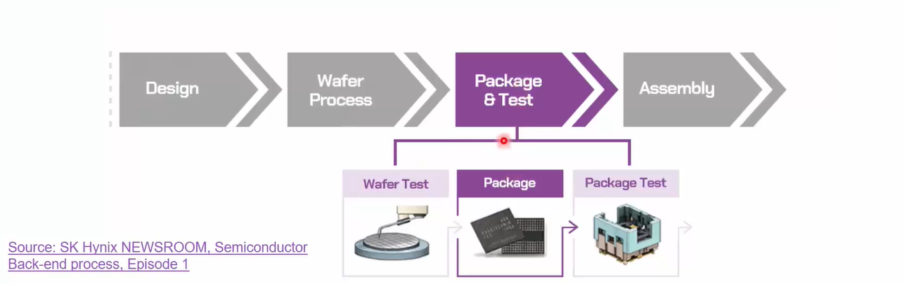
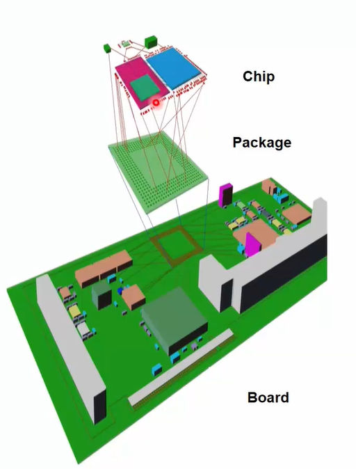
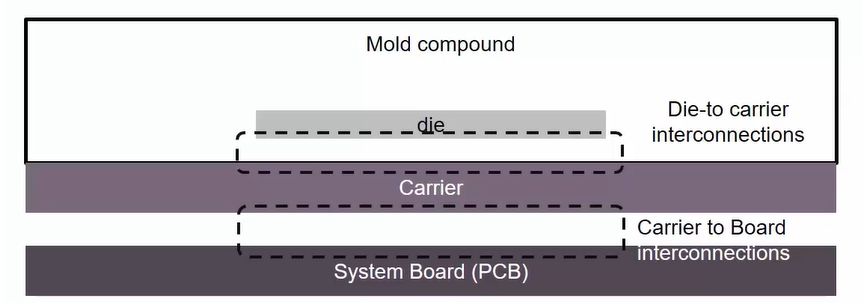
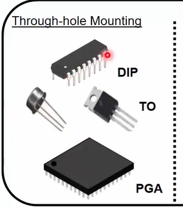
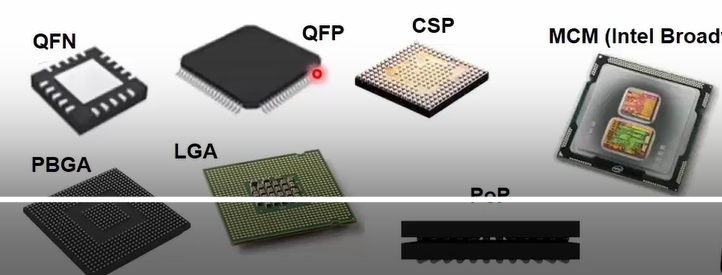
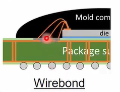
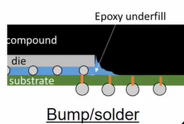
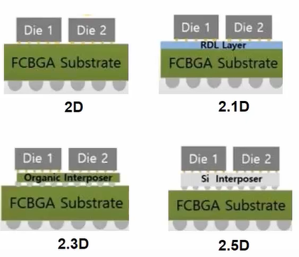

# Semiconductor_Packaging
<h1> Day 1 - Basics of Packaging </h1>

<h3> What is Packaging? </h3>

 Once after the SOC architecture has been designed, the design team will create RTL followed by the layout. This layout is sent to the foundry to manufacture it in a wafer. Various wafers which are needed in the design are tested for quality and then packaged into a single SOC chip. After significant testing these SOC are added to the rest of the components in the motherbnoard in a PCB board.

<h3>Typical Package structure</h3>

The Die is attached to a carrier through an interconnection. The options for interconnections are Wirebond or Bump/solder. Various dies can be connected to the same carrier. The carrier is acting like a substrate onto which the die attached. This assembly is protected using a Mold compound like epoxy. This whole package is added on to the PCB board through any of these interconnection technologies - Through hold mounting or Surface mounting. 

<h3>Through hold mounting.</h3>

These devices are attached to the PCB board through soldering. The component is inserted into a hold and the pins are locked to the board through solering. Examples are 

<UL>
<LI>Dual in-line package - Pins are only in the 2 sides </LI>
<LI>TO package - Transistor outline</LI>
<LI>PGA package - Pin grid array - Pins are in all 4 sides</LI>
</UL>

<h3>Surface mounting</h3>

These devices does not require a hole in the PCB to attach, instead there are soldered on the surface of the PCB. Examples are. 

<UL>
<LI>QFN - Quad flat no lead - Does not have any leads</LI>
<LI>QFP - Quad flat package - Have leads which can be surface mounted.</LI>
<LI>CSP - Chip Scale package - Have solder balls with a constricted area requirements between die and substrate. The design is similar to PBGA and used when package size need to very small.</LI>
<LI>PBGA - Plastic Ball grid array - Uses a grid of solder balls to connect. The solder balls attached to the die and the attachment gaps are made on the surface of the PCB</LI>
<LI>LGA - Land grid array - Has the gaps for solder balls and the solder balls are added on the surface of the PCB.</LI>
<LI>PoP - Package on package - Consists of the package of ball grid array on top of another package connected through ball grids.</LI>
<LI>MCM - Multi chip module - used to connect various dies to the substrate. More details later.</LI>
</UL>

<h3> Some options for the carrier/substrate </h3>

Laminate, plastic, cermainc, organic RDL and Silicon.

<h3> Wire bond interconnections </h3>

 The pads are added on the top of the die and substrate. These are connected using Gold wires.

<h3> Bump interconnections </h3>

 The die is mounted to the substrate through a ball grid array which is protected and supported with an underfill typically made of epoxy. When both the connections are using solder balls (die to substrate and substrate to PCB), its called flip chip PBGA (FCPBGA).

<h3>Advanced package substrates</h3>

<UL>
<LI>2D - It contains multiple die in connected to a commond FCBGA substrate.</LI>
<LI>2.1D - This adds a RDL (redistribution layer) layer to 2D package which enables to connection between various dies without going through the substrate. It has a limited density and performance of the interconnects</LI>
<LI>2.3D - This adds an organic interposer which offers more density for the interconnects as we can have mutiple metals layers for routing. </LI>
<LI>2.5D - This addes a Silicon based interposer for improved speed and bandwidth.</LI>
</UL>

