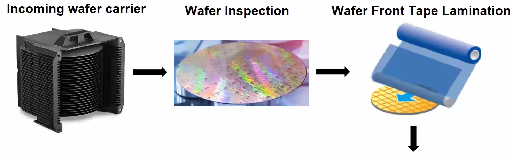
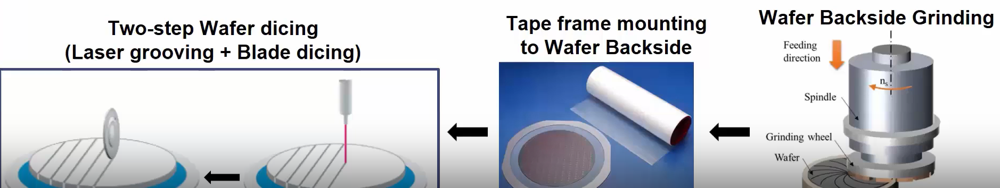
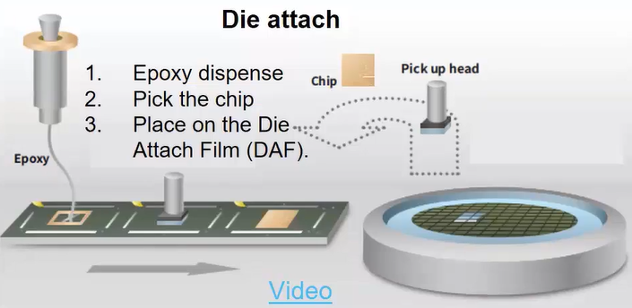
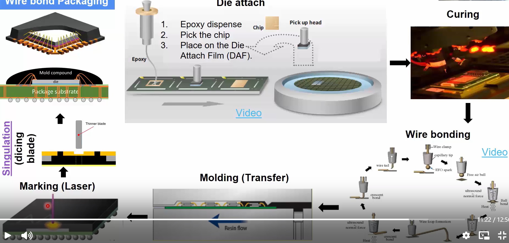
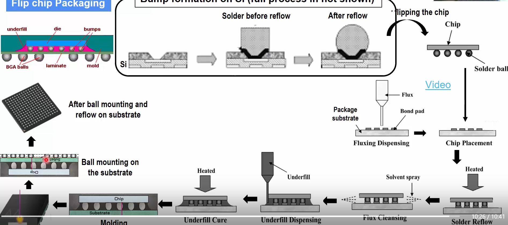
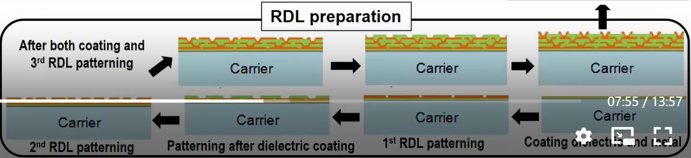

# Semiconductor_Packaging
<h1> Day 2 - From Wafer to Package </h1>

This sections covers various activities happening in a clean room faciltiy right after the wafer has been fabricated

<h3>Wafer Inspection</h3>
   The incoming wafer bulk is inspected for any defects and the non defective wafers are passed to the next steps.
<h3>Wafer front Tape lamination</h3>
   The front portion of the die where the chip is fabricated is taped out to prevent any damage during the packaging process.
<h3>Wafer backside grinding</h3>
    Due to mechanical stability, the wafer is manufactured with a certain thickness which can take unwanted space in the package. So the backside of the wafer is grinded to make it a fine print.
<h3>Wafer dicing</h3>
    The die is then seperated from the wafer through laser grooving followed by blade dicing.

<a href="https://www.youtube.com/watch?v=hR5orrmpoeE">Practical example</a>

<h3>Die attach</h3>

The die is taken from the wafer and stuck to the substrate using an epoxy marked in a specific pattern for efficiency. This is then cured in an oven.

<a href="https://www.youtube.com/watch?v=jliiUV0vDic">Link to the video </a>

<h3> Wire bonding </h3>

A ball of gold is created in the nozzle to be stuck to the pad in the die. It is then attached firmly using heat, ultrasound and force. The nozzle is moved based on the required pattern towards the pad in the substrate and the similar process is used to attach it to the pad.

<a href="https://www.youtube.com/watch?v=tp_Yv0cyvFw">Example 1</a>

<a hreg="https://www.youtube.com/watch?v=3XzyB7avNGs">Example 2</a>

<h3>Molding</h3>

The whole package is protected by adding a molding component.

<h3>Flip Chip packaging</h3>

In case of FCBGA packaging, the die has to be attached to the substrate using a solder instead of wires.

<h3>RDL prepration for advanced packaging </h3>

The Re-distribution layer is also prepared in the clean room foundry and provided as a wafer. On top of the substrate, various layers of the RDL and the connections in each layer are routed.

Finally, the whole package is test completely for defects and deployed. 
