# Semiconductor_Packaging
<h1> Day 3 - Semiconductor packaging workshop from VSD </h1>
<h2> Designing a Flip Chip BGA package </h2>

<h3> Creating the package </h3>

 The IcePak simulator to design and test the package. We start by creating a package from Tool options Icepak -> Tookit -> Geometry -> Packages -> Flip Chip  BGA. The package size is 15mm x 15mm x 1.6mm.

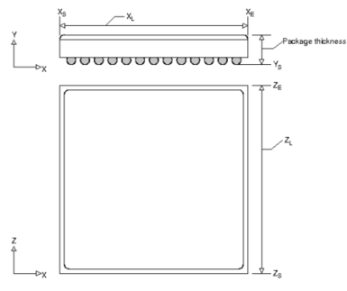

Next, the die dimentsion is selected. In thi case, we have a die size which is half the size of package. 8.56mm x 8.56mm. The die thickness is negligible. The die is supposed to consume 1W power and generate heat based on the consumption. A suitable underfill material is added between the die and the BGA array of the die which is of 0.01mm in thickness.

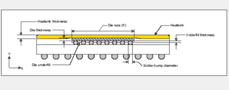

We then select the substrate on which the die needs to be placed. The substarate is designed to have 2 intermediate routing layers and the thickness is chosen to be 0.36mm. The traces are made in pure Copper. At this point we don't have any heat dissipating via.

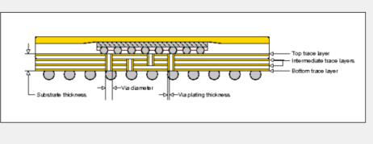

Finally, we design the Solder for the package. Here 14 solder balls in both X and Y dimensions are chosen. The material is Pb50_sn50. 

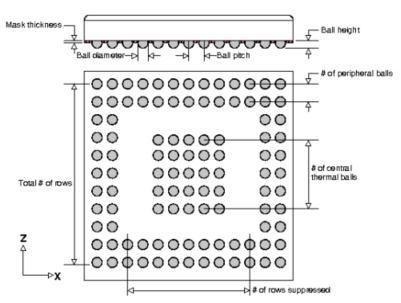

The created package looks as like below.

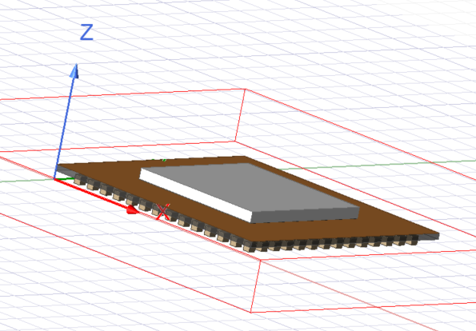

<h3>Adding boundary condition to Substrate and die.</h3>

The boundary conditions are added to the die using the option from the project Manager Thermal -> Flipchip_BGA1_die_source. We also add boundary conditions to the substrate by Right click on the Model's Flipchip_BGA1_substrate -> Assign Thermal -> Source -> Set Fixed temperature -> AmbientTemp. (Note : delete the pre-assigned Flipchip_BGA1_trace1 from Project to avoid Overlap warnings).

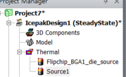

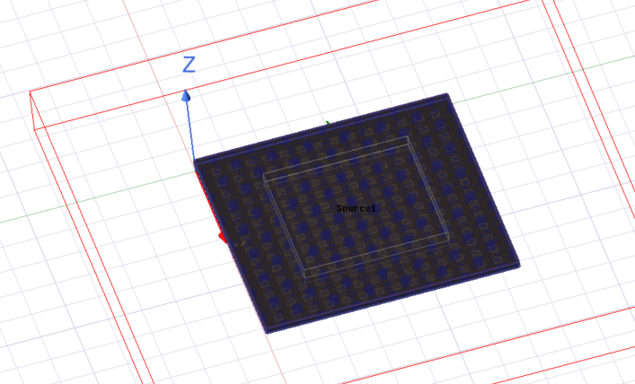

<h3> Adding Monitors </h3>

Setup monitor to the substrate by right clicking on the Model's Flipchip_BGA1_substrate -> Assign Monitor -> Point -> Temperature. Setup monitor to the die by right clicking on the Model's Flipchip_BGA1_die -> Assign Monitor -> Point -> Temperature. Setup monitor to the undefill by right clicking on the Model's Flipchip_BGA1_die_underfill -> Assign Monitor -> Point -> Temperature. 

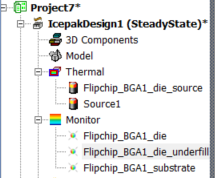

<h3>Adding Mesh </h3>

Click on Mesh from the Project Manager -> Simulation -> Generate Mesh. It create a Mesh the package.

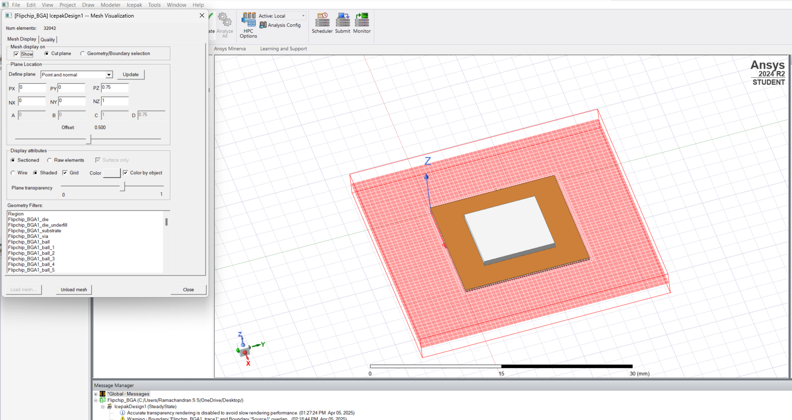

<h3>Performing Analysis</h3>

 Finally, we ise a Solver from Analysis section of the projectmanager -> Add Solution setup -> Set problem types as Temperature and Flow (Keep everything defaults). To check everything's fine, click on validate in toolbar.

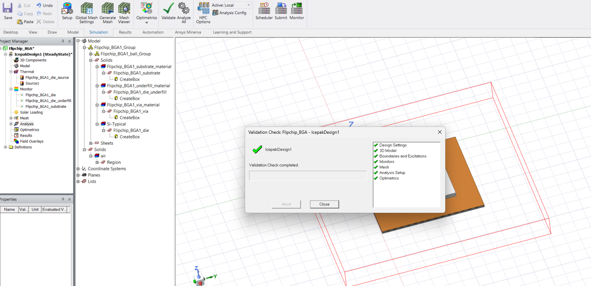

Note: If there is any Warning regarding Object does not mesh. Right click the Object from Model -> Assign Mesh Region. If there is an error stating "Failed to launch mesher", delete MeshRegion1 from the Project Manager. Rerun Generate Mesh followed by Analyze All.

<h3>Plotting the temperature graph.</h3>

Select the whole package (by dragging) and right click -> Plot fields -> temperature -> Check Specify Name and Specify folder -> Check Plot on Surface Only -> Goto Surface Smoothing and Enable Gaussing Smoothing.

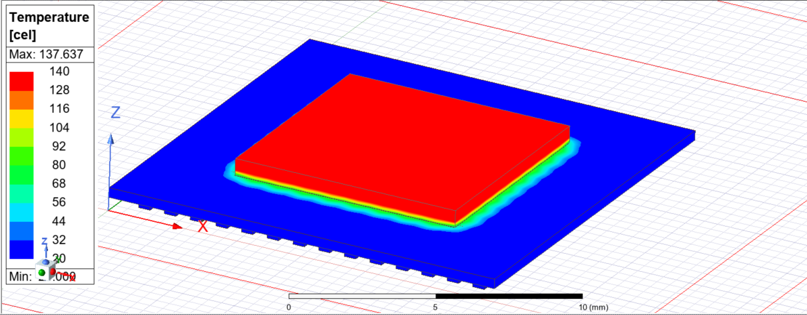

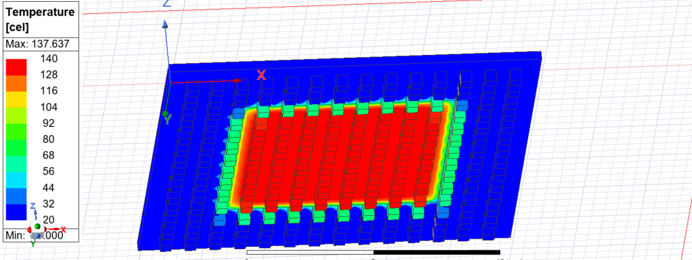