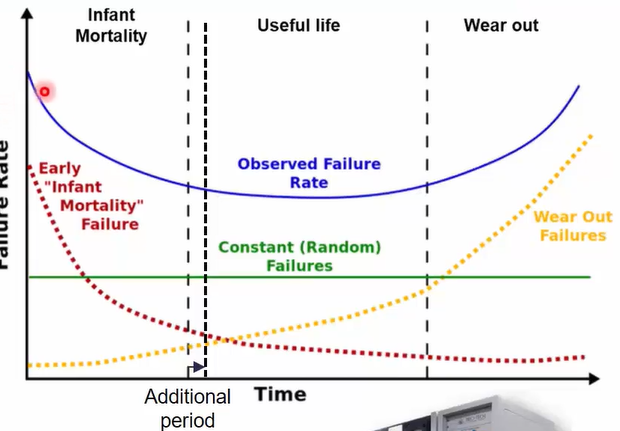

# Semiconductor_Packaging
<h1> Day 4 - Package Testing and performance validation </h1>

<h3>Major testing done after packaging.</h3>

We start wtih functional tests along with open and short circuit testing. Then, thermal and voltage stress is done to ensure early-life reliability. Finally, Cold and Hot test for validating functional, parametric and reliability specs across temperature and these data is added to the chip's datasheet.

<h3>Assembly Open and Short test</h3>

The packages are put through an open and short test to screen for massive electrical fails before leaving the assembly.

<h3>Burn-in Test</h3>

This accelerates the failures by applying high voltage and high temperature stress. Defects like dielectric and metallization failures, electromigration can be detected.

<h3>Final Test</h3>

The final test is a temperature corner test to verify that the packaged product meets the specification in a particular temperature range. The parts are passed through Hot and Cold environment to find out the suitable temperature of operation. These details are found in the datasheet of the IC.

<h3>Summmary </h3>

The Automatic test equipment (ATE) is used to send test patterns to the DUT. The Major test categories include:

<UL>
<LI>Parametric tests: Measures current/voltage from the unit to ensure the circuits are operating within the specified parameters.</LI>
<LI>Functional tests:Evaluate the functionality of the DUT in all the operating conditions specified.</LI>
<LI>Speed tests: Testing the Performance of the DUT and check whether it matches the specifications.</LI>
</UL>