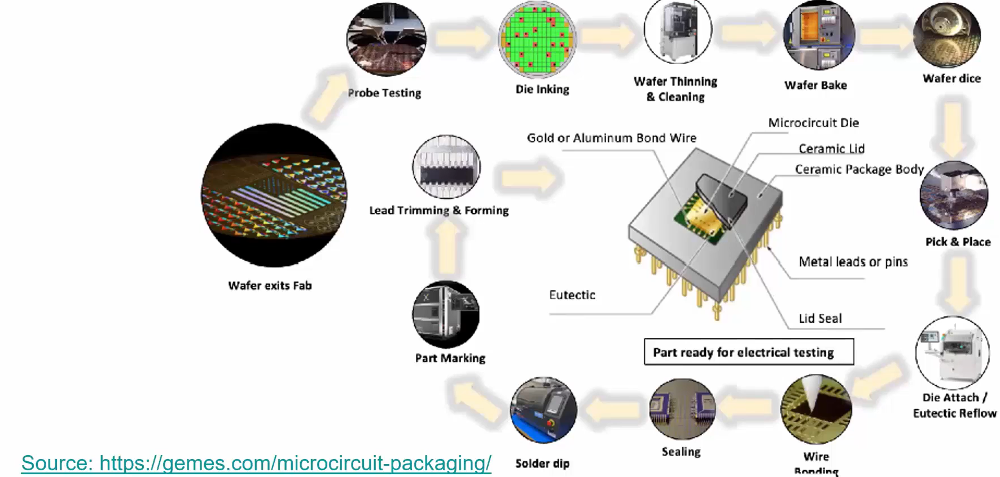
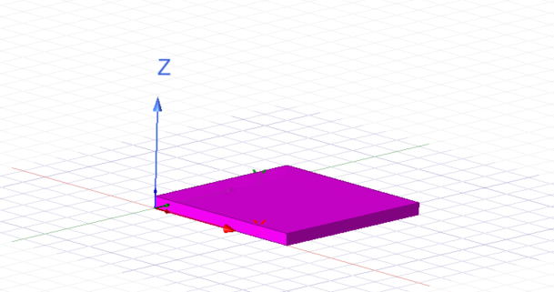
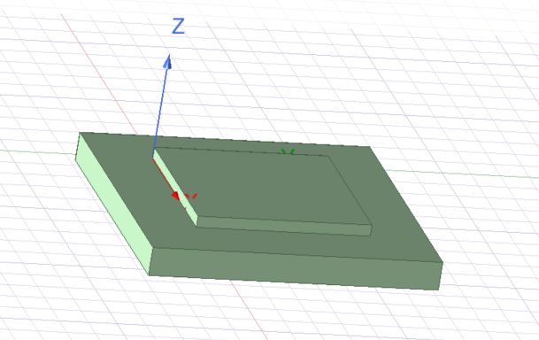
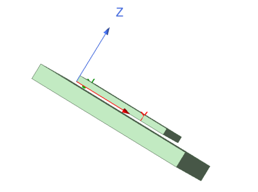
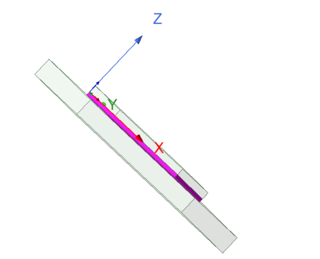
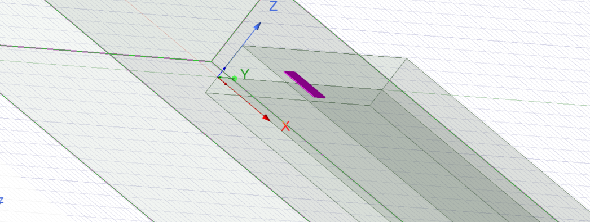
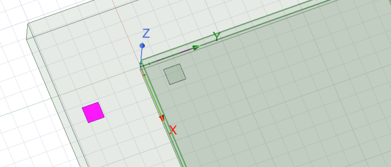
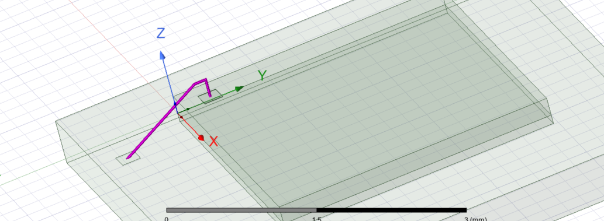
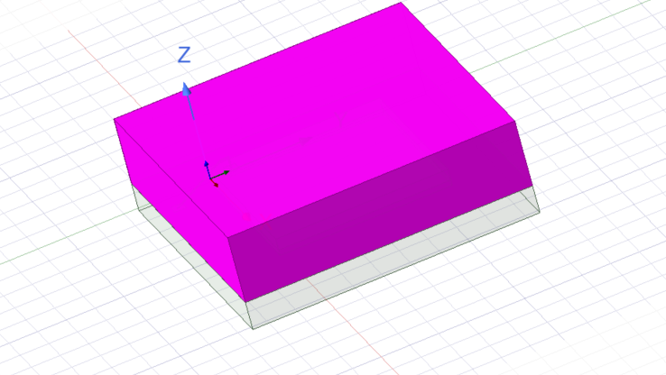
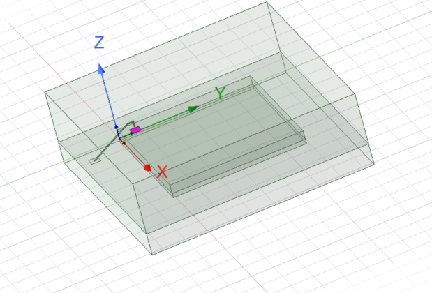

# Semiconductor_Packaging
<h1> Day 5 - Semiconductor packaging workshop from VSD </h1>
<h2> Creating the Semiconductor package cross-section. </h2>

The Objective is to create a virtaul model of the package cross-section till molding/sealing stage. 

We will be using Q3D to extract the parasitics from design.

<h3>Creating the Die</h3>

 We will be creaing a die of size 3mm  x 3mm with a thickness of 0.2mm (this will be after thinning stage) at a position of 0,0,0. Start by drawing a rectangle using the icon from the toobar. Click on CreateRectange from Model to set the size. Now to add thickness, we create a 3D object from the Modeler option from the toolbar (select rectangle first) -> Surface -> Thicken Sheet. Double click on the Rectange from the Model to set the properties where we select the material to be Silicon.

<h3>Creating the Substrate</h3>

Draw a rectange in the same way as before and the size to have 5mm x 5mm. Here, the position is set based on the die. So we have -1.-1.0. Make it 3D in the same way as above with a thickness of 0.5mm. Set it to -0.5mm to add it below the die. Choose the material to be FR4_epoxy. The die is supposed to be attached through wire bond.

<h3>Adding Die attach material</h3>

The first step is to create space between the die and the substrate so that we can die attach there. Move the substrate position to -1,-1,-0.1.

Draw a rectange in the same way for the die attach material and set the size to have 3mm x 3mm and position to be 0,0,0. Make it 3D with a thickness of -0.1mm. Set the material to be modified_epoxy.

<h3>Adding the bond pad</h3>

Start by creating a rectangle and set the size as 0.2mm x0.2mm and position should be at 0.2mm x 0.2mm x 0.2mm. Since it's a wire bond we add the pad on top of the die. Make it 3D with a thickness of 0.005mm. The material here is copper.

Next, create a wire bond pad on the substrate by drawing a rectangle and setting the size as 0.2mm x 0.2mm with a position of 0.2,-0.8,-0.1.

<h3>Adding the bond wire</h3>

Using the draw bondwire tool, connect both the pads from middle of the die to middle of the substrate. Use defaults for the parameter. Assign Gold as material

<h3>Adding the Mold component</h3>

Start by creating a rectangle with size of 5mm x 5mm with position -1 ,-1.,-0.1. Make it 3D with a thickness of 1.2mm. Use epoxy_kevlar_xy as material.

The final layout looks like below.

