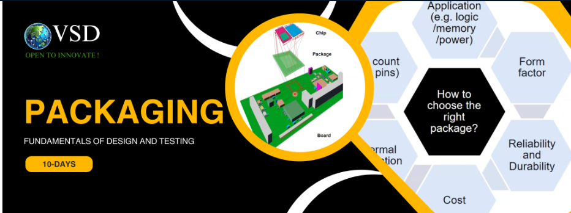

# Semiconductor_Packaging
Semiconductor packaging workshop from VSD - Lecture notes and labs

A 5 day workshop to cover the Semiconductor Packaing essentials. The Ansys Electronics suite is used to develop and analyze the package.

<UL>
<LI>Day 1 - Packaging Basics</LI>
<LI>Day 2 - From Wafer to Package</LI>
<LI>Day 3 - Thermal Analysis of Package in Ansys IcePak</LI>
<LI>Day 4 - Package testing and performance validation</LI>
<LI>Day 5 - Designing a Package and parasitic extraction in Ansys Q3D</LI>
</UL>

# Note

The readme for each day are in the respective folders.
